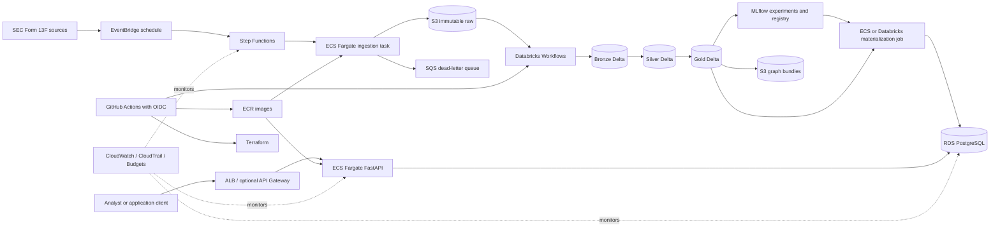

# WealthSignal AWS and Databricks Architecture Execution Plan

## Purpose and authority

This document is the implementation roadmap for evolving WealthSignal from a verified research repository into an industry-style, cost-controlled AWS and Databricks system. It complements the forecasting protocol and cloud compute plan; it does not change the frozen Protocol V2 cohort, data, folds, metrics, promotion gate, or prospective-test rules.

Use one milestone at a time. Codex must verify prerequisites from code and measured artifacts, implement only the selected milestone, run its checks, and commit it before continuing. No milestone authorizes paid resources, account creation, deployment, prospective-data access, or external publication unless the project owner explicitly grants that authority.

## Verified starting point

- Cloud 1 source verification, Cloud 2 exact 50-manager reconciliation, and Cloud 3 cap-500 Gold construction passed.
- The accepted Gold table contains 5,154,259 examples across 28 target quarters with zero recorded leakage or nested-cap reconciliation violations.
- The 20,000-row Databricks Free Edition environment-client-4 Spark ML smoke passed in run `818005580828490`.
- Four full-volume Cloud 4 attempts failed before the first fold checkpoint. The current evidence is `docs/ai-governance/cloud4-free-edition-nine-fold-gate.json`.
- The latest failure was a fixed Spark Connect model-response ceiling, not a fair-use quota or out-of-memory signal. Do not restart all nine folds until a full-volume, first-fold-only gate passes.
- Prospective 2026 Q2 truth remains unopened. No paid AWS, paid Databricks, RunPod, or other billable resource is authorized.

## Architecture decisions

1. **S3 owns durable cross-platform objects.** It stores source packages, Delta/Parquet data, graph bundles, models, reports, and immutable manifests. It does not replace PySpark.
2. **Databricks owns distributed lakehouse processing and ML lineage.** PySpark transforms data; Delta supplies transactional tables; Unity Catalog supplies governed access; MLflow supplies experiment and model lineage.
3. **RDS PostgreSQL owns operational application state.** It stores compact approved forecasts, alerts, client portfolios, run metadata, and serving indexes. It does not duplicate the full Gold dataset.
4. **ECS Fargate runs application containers and bounded ingestion.** ECR stores immutable images. Do not introduce EKS until measured scale or organizational requirements justify Kubernetes.
5. **Step Functions coordinates systems; Databricks Workflows coordinates Databricks tasks.** EventBridge starts scheduled workflows. SQS and dead-letter queues preserve retryable failures.
6. **GitHub is the source of truth.** GitHub Actions uses OIDC for short-lived AWS credentials. Terraform defines cloud infrastructure. Databricks jobs are versioned and deployed from committed code.
7. **Promotion is artifact-driven.** Experimental tables and models never become API outputs merely because training completed. Promotion requires frozen checksums, evaluation evidence, and reviewer approval.
8. **Cost is an acceptance criterion.** Every deployed service requires a budget, owner, tags, shutdown behavior, and deletion procedure.

## Target architecture



## Environment strategy

Start with `local` and `dev`. Add `prod` only after Cloud 4 acceptance and a real serving requirement.

| Environment | Purpose | Data | Compute |
|---|---|---|---|
| Local | Unit tests, Docker Compose, fixtures, API development | Synthetic or small ignored files | Developer machine |
| Dev | Reproducible cloud integration and non-prospective research | Immutable V2 development artifacts | Databricks plus bounded AWS services |
| Prod | Approved forecast serving only | Promoted artifacts and operational records | Explicitly approved managed services |

Never copy production secrets into local files. Never use prospective truth to validate infrastructure.

## Storage and data contracts

Use separate buckets per environment when deployment begins. A suggested layout is:

```text
s3://wealthsignal-<env>-<account-id>/
  raw/sec-13f/package=<package-id>/
  bronze/report_year=<year>/report_quarter=<quarter>/
  silver/normalized-holdings/report_year=<year>/report_quarter=<quarter>/
  gold/temporal-examples/target_year=<year>/target_quarter=<quarter>/
  graph/protocol=<protocol-id>/dataset=<dataset-id>/
  models/model=<model-id>/version=<version>/
  reports/run=<run-id>/
  manifests/
  quarantine/
```

Required controls:

- S3 Block Public Access, versioning, KMS encryption, and lifecycle rules;
- immutable source manifests with URL, retrieval time, size, and SHA-256;
- least-privilege IAM prefix access;
- Unity Catalog storage credentials and external locations backed by IAM roles, never access keys;
- separate raw, curated, model, and report privileges;
- retention rules that preserve accepted artifacts and expire disposable staging data;
- no raw SEC ZIPs, large Delta files, database snapshots, or model binaries in Git.

## Application and service contracts

### Pipeline worker

The existing `pipeline-worker` image evolves into bounded task entrypoints:

- acquire and checksum an approved SEC package;
- validate and place source objects in S3;
- trigger or poll an approved Databricks job;
- materialize an accepted forecast into PostgreSQL;
- expose health only when running as a service.

Long-running bulk ingestion belongs in ECS Fargate, not Lambda. Every task must be idempotent by package or run ID.

### Decision API

The existing FastAPI image runs on ECS Fargate behind an ALB. It reads RDS PostgreSQL and returns only approved, lineage-bearing records. Experimental Gold data and unpromoted model outputs are not served.

Add API Gateway only when API keys, usage plans, public throttling, or a separate public API product are required. Add Cognito only when real user authentication is required.

### PostgreSQL

Use RDS PostgreSQL for forecast runs, ranked predictions, filing metadata, alerts, client portfolios, audit status, and serving indexes. Use migrations, automated backups, encryption, private subnets, TLS, and Secrets Manager rotation. Do not store the 5.15-million-row Gold research table in RDS.

### Redis

Keep Redis local-only until a measured cache, rate-limit, distributed-lock, or ephemeral job-state requirement exists. Do not deploy ElastiCache as a resume keyword.

## Orchestration contract

The cross-platform workflow is:

```text
EventBridge
  -> Step Functions
  -> ECS acquisition task
  -> checksum and S3 manifest gate
  -> Databricks Workflow
  -> data-quality, leakage, and artifact gate
  -> approved forecast materialization
  -> RDS
  -> notification and audit record
```

Step Functions owns cross-service state and retry policy. Databricks Workflows owns Bronze-to-Silver-to-Gold and ML task dependencies. Do not schedule the same production workflow independently in both systems.

Every state transition must record a stable run ID, code revision, input checksum, output checksum, start/end time, status, and failure reason. Retries must not overwrite accepted artifacts.

## Security and networking

- Use one AWS account initially with strict `dev` resource prefixes; a later production account is preferable to a complex shared VPC for this project.
- Use GitHub Actions OIDC to assume a narrowly scoped deployment role. Do not store long-lived AWS keys in GitHub.
- Give ECS tasks dedicated task roles. Separate ingestion, API, and deployment permissions.
- Connect Databricks to S3 through an IAM role and Unity Catalog external location.
- Put RDS in private subnets. Permit inbound database traffic only from the API/materialization security groups.
- Expose only the ALB publicly. Keep ECS tasks private when NAT or VPC endpoints are justified.
- Avoid a NAT Gateway in the first bounded architecture because its idle hourly cost can dominate a portfolio project. Add it only with a measured connectivity requirement and cost approval.
- Store secrets in Secrets Manager; encrypt S3, RDS, logs, and queues with managed or customer-managed KMS keys as appropriate.
- Enable CloudTrail, CloudWatch logs, AWS Config or Security Hub only to the level justified by the deployed scope.
- Tag every resource with `project`, `environment`, `owner`, `managed-by`, `cost-center`, and `expires-on` where temporary.

## CI/CD and infrastructure as code

Use Terraform with remote state only after the bootstrap milestone. Keep modules small:

```text
infra/
  bootstrap/
  modules/
    storage/
    iam/
    ecr/
    ecs/
    database/
    orchestration/
    observability/
  environments/
    dev/
    prod/
```

GitHub Actions gates:

1. Pull request: tests, compilation, JSON validation, secret scan, container build, Terraform format/validate, and plan artifact.
2. Merge: build once, tag image with Git SHA, push to ECR, and deploy only to dev under environment approval.
3. Data/ML run: execute only an approved non-prospective job and attach immutable reports.
4. Promotion: manual approval promotes an existing image/model digest; never rebuild during promotion.

Pin actions by immutable revision where practical. Use environment protections for deployment and production. A passing CI workflow does not authorize cloud creation unless the milestone explicitly includes deployment approval.

## Observability, reliability, and recovery

Minimum metrics and alarms:

- ingestion package age, checksum failure, and quarantine count;
- Step Functions failures and DLQ depth;
- Databricks job outcome, fold progress, runtime, and lineage completeness;
- API request count, latency, error rate, and task health;
- RDS connections, storage, CPU, backup status, and query latency;
- S3 object count/bytes by prefix and lifecycle transitions;
- monthly forecast and actual cost by service.

Retain structured logs with `run_id`, `dataset_id`, `model_id`, and `code_revision`. Never log secrets or full sensitive payloads. Test RDS restore and artifact checksum reload before describing the system as recoverable.

## Cost policy

Before deployment, create an AWS Budget with alerts and a project cost-allocation tag. Prefer scale-to-zero or task-based services. Prohibited by default:

- always-on EC2 or SageMaker;
- idle NAT Gateway;
- Multi-AZ RDS before a production availability requirement;
- EKS merely to demonstrate Kubernetes;
- unattended GPU compute;
- duplicate storage of the same large dataset without a retention reason.

Every milestone that creates resources must provide an estimate, maximum approved spend, auto-stop behavior, and destroy command before creation. Destruction must preserve accepted S3 artifacts and audit manifests unless the owner explicitly approves their deletion.

## Execution milestones

### A0 - Reconcile roadmap and freeze architecture decisions

Scope: documentation only.

1. Correct stale Cloud 4 status in all authoritative documents.
2. Record the S3/Databricks/RDS/ECS responsibility boundary.
3. Create architecture decision records for orchestration, storage ownership, compute escalation, and serving.
4. Inventory current AWS and Databricks accounts read-only; do not create resources.
5. Record region, account ownership, intended budget, and data classification.

Acceptance: documents agree with measured Cloud 4 evidence; no resource was created; secrets scan and tests pass.

Local checkpoint (2026-08-17): the responsibility and status documents are reconciled, and ADRs for storage, orchestration, compute escalation, and serving are recorded under `docs/architecture/`. Read-only account evidence is recorded in `docs/architecture/dev-platform-baseline.md`. AWS account use, final dev region, budget ceiling, and alert recipients still require owner confirmation before A3; no resource was created.

### A1 - Prove the Cloud 4 full-volume first-fold gate

Scope: Databricks Free Edition engineering evidence only.

1. Add a first-fold-only submission using environment client 4 and commit `77d86c0` or a reviewed descendant.
2. Use the complete permitted training volume and exactly the first validation fold.
3. Exercise graph preparation, preprocessing, required baseline fits, action diagnostics, metrics, and one atomic restart checkpoint.
4. Record all model-response sizes, runtime, table/checkpoint identities, and the exact failure or success point.
5. Do not select final hyperparameters or access prospective truth.

Acceptance: one complete full-volume fold reloads from its checkpoint with complete lineage. If a required estimator still exceeds the Spark Connect ceiling, mark Free Edition blocked and prepare a paid-compute decision; do not retry the nine-fold job unchanged.

Local checkpoint (2026-08-17): `databricks/cloud4-first-fold-submit.json` invokes the full runner with `--first-fold-gate`, environment client 4, the complete permitted training history, exactly the first frozen validation fold, isolated graph/checkpoint tables, estimator-fit evidence, and checkpoint reload validation. Cloud submission remains separately approval-gated.

### A2 - Choose the compute path

If A1 passes, resume the restartable nine-fold job on Free Edition. If A1 proves a fixed serverless limitation, compare:

- a serverless-compatible algorithmic rewrite that preserves the frozen model contract;
- a bounded AWS-connected Databricks trial;
- CPU-only classic jobs compute with auto-termination.

Produce expected runtime, compatibility, migration work, maximum cost, and cleanup plan. Wait for explicit approval before account signup or paid compute.

Acceptance: a written decision backed by measured A1 evidence; no prospective access.

### A3 - Bootstrap AWS safely

Scope: lowest-cost foundation only after approval.

1. Add Terraform bootstrap and dev-environment structure.
2. Create AWS Budget alerts, project tags, KMS key or approved managed-key policy, versioned private S3 bucket, ECR repositories, and GitHub OIDC deployment role.
3. Enable only necessary logs and audit trails.
4. Validate least privilege and document destroy/recovery procedures.

Acceptance: Terraform plan is reviewed; apply requires explicit approval; post-apply identity, encryption, public-access, budget, and drift checks pass.

### A4 - Connect S3 and Databricks

1. Create a Databricks IAM access role and Unity Catalog storage credential.
2. Create external locations scoped to raw, curated, graph, model, and report prefixes.
3. Grant least-privilege catalog permissions.
4. Copy one non-prospective development artifact, verify its checksum, read/write a small Delta table, and prove access revocation.
5. Design migration for accepted managed tables; do not delete the current copies until reload and checksum gates pass.

Acceptance: role-based access with no static keys, workspace binding where supported, checksum equality, and documented rollback.

### A5 - Container registry and bounded ingestion

1. Harden Docker builds with pinned dependencies, non-root runtime, health checks, and image scanning.
2. Push Git-SHA-tagged images to ECR through GitHub OIDC.
3. Deploy one manual ECS Fargate ingestion task with an ingestion-specific task role.
4. Write one approved historical SEC package to the raw prefix idempotently.
5. Verify logs, checksum manifest, duplicate replay, quarantine behavior, and cleanup.

Acceptance: repeat execution produces no duplicate logical artifact; image digest, task definition, source checksum, and cost are recorded.

### A6 - Cross-platform orchestration

1. Add Step Functions for acquisition, checksum gate, Databricks invocation/polling, artifact validation, and notification.
2. Add SQS DLQ and bounded retries.
3. Add an EventBridge manual/test trigger before any schedule.
4. Prove success, deterministic replay, and injected failure paths.
5. Enable the quarterly schedule only after owner approval.

Acceptance: one traceable non-prospective end-to-end dev run; retries are idempotent; failures remain visible.

### A7 - Operational database and API

1. Provision the smallest justified private RDS PostgreSQL instance after approval.
2. Add migrations, TLS, Secrets Manager integration, backups, and restore test.
3. Deploy FastAPI to ECS Fargate behind an ALB.
4. Materialize only an approved reference forecast and lineage.
5. Add authentication only when a real user boundary is defined.
6. Load-test a bounded read path and inspect query plans.

Acceptance: private database, healthy service, reproducible deployment, rollback, restore evidence, latency/error measurements, and no experimental output exposed.

### A8 - ML promotion, monitoring, and release

1. Complete Cloud 4 and graph/tabular reconciliation.
2. Freeze dataset, feature, model, environment, and promotion manifests.
3. Add promotion workflow from MLflow/Gold to RDS using immutable IDs.
4. Add freshness, drift, data-quality, model, API, and cost dashboards/alarms.
5. Test recovery from failed materialization and stale source data.
6. Create a signed release only after all gates pass.

Acceptance: trace from API response to RDS record, model, code revision, Gold partition, Silver holdings, and raw SEC checksums. Prospective evaluation remains separately authorized.

## Codex milestone protocol

For every architecture milestone, Codex must:

1. Read this document, `docs/WealthSignal_Cloud_Execution_Plan.md`, `docs/CODEX_PROJECT_NAVIGATION.md`, and the directly relevant code/evidence completely.
2. Inspect Git status and preserve unrelated changes.
3. Verify the prerequisite using measured evidence rather than roadmap claims.
4. State whether the task is documentation, local implementation, read-only cloud inspection, or resource creation.
5. Stop for approval before signup, Terraform apply, deployment, scheduling, spending, destructive migration, or prospective access.
6. Implement the smallest complete milestone.
7. Run tests, formatting/static checks, Terraform validation where relevant, secret scan, and targeted integration checks.
8. Update measured reports and documentation without rewriting failed history.
9. Report files, commands, tests, artifacts, costs, limitations, rollback, and exact next milestone.

## Exact prompt for the next milestone

```text
Read docs/WealthSignal_AWS_Databricks_Architecture_Plan.md, docs/WealthSignal_Cloud_Execution_Plan.md, docs/CODEX_PROJECT_NAVIGATION.md, docs/ai-governance/cloud4-free-edition-nine-fold-gate.json, cloud4_contract.py, and their tests completely. Execute only milestones A0 and the local implementation portion of A1.

First reconcile every authoritative status document with the four retained full-volume Cloud 4 failures. Then implement a committed environment-client-4 full-volume, first-fold-only gate that exercises graph preparation, preprocessing, required model fits, action diagnostics, metrics, and one atomic restart checkpoint. Add focused tests and a submission file, but do not submit any cloud job, create AWS resources, access prospective truth, restart all nine folds, or incur cost without explicit approval. Finish with validation evidence and the exact reviewed command that would run the bounded gate after approval.
```

## Definition of an industry-standard result

WealthSignal may describe this architecture as implemented only when the repository contains tested IaC, immutable CI/CD artifacts, least-privilege role evidence, a governed S3/Databricks data path, idempotent orchestration, recoverable serving storage, observable workloads, cost records, and end-to-end lineage. A diagram, account, bucket, or list of AWS services alone is not implementation evidence.
